# CRM Client App - React Frontend

This is the React frontend for the CRM Client Data Fetcher application. It provides a user interface for retrieving client data from the external CRM server.

## Technology Stack

- **React 18**: UI library
- **Vite**: Build tool and development server
- **ESLint**: Code linting

## Project Structure

```mermaid
graph TD
    Root[ClientApp/<br/>⚛️ React Frontend]
    
    Root --> Src[src/<br/>📝 Source Files]
    Root --> Public[public/<br/>🌐 Static Assets]
    Root --> ViteConfig[vite.config.js<br/>⚡ Vite Configuration]
    Root --> PackageJson[package.json<br/>📦 Dependencies]
    Root --> IndexHTML[index.html<br/>📄 HTML Entry]
    
    Src --> AppJSX[App.jsx<br/>⚛️ Main React Component]
    Src --> AppCSS[App.css<br/>🎨 Component Styles]
    Src --> MainJSX[main.jsx<br/>🚀 Application Entry]
    Src --> IndexCSS[index.css<br/>🎨 Global Styles]
    Src --> Assets[assets/<br/>🖼️ Images & Icons]
    
    Public --> ViteSVG[vite.svg<br/>🖼️ Logo]
    
    classDef root fill:#61dafb,stroke:#20232a,stroke-width:3px,color:#000
    classDef folder fill:#4ec9b0,stroke:#fff,stroke-width:2px,color:#000
    classDef config fill:#ffa500,stroke:#fff,stroke-width:2px,color:#000
    classDef file fill:#007acc,stroke:#fff,stroke-width:2px,color:#fff
    
    class Root root
    class Src,Public,Assets folder
    class ViteConfig,PackageJson,IndexHTML config
    class AppJSX,AppCSS,MainJSX,IndexCSS,ViteSVG file
```



## Development

### Prerequisites

- Node.js 16 or higher
- npm or yarn

### Installation

```bash
npm install
```

### Running Development Server

```bash
npm run dev
```

The development server will start on `http://localhost:5173`.

The Vite dev server is configured to proxy `/api` requests to the backend at `http://localhost:5000`.

### Building for Production

```bash
npm run build
```

This creates an optimized production build in the `dist` directory, which will be copied to the backend's `wwwroot` directory during deployment.

## Features

- **Client Data Form**: Enter a client ID to retrieve data
- **API Integration**: Communicates with the ASP.NET Core backend API
- **Error Handling**: Displays user-friendly error messages
- **Loading States**: Shows loading indicators during API calls

## API Integration

The frontend makes requests to the backend API:

```javascript
GET /api/Crm/GetClientData?id={clientId}
```

The API proxy is configured in `vite.config.js` to forward requests to `http://localhost:5000` during development.

## Configuration

### Development Proxy

The Vite dev server proxies API requests. Configuration in `vite.config.js`:

```javascript
server: {
  proxy: {
    '/api': {
      target: 'http://localhost:5000',
      changeOrigin: true
    }
  }
}
```

### Production

In production, the built React app is served as static files from the ASP.NET Core application's `wwwroot` directory. No proxy configuration is needed as the frontend and backend are served from the same origin.

## Component Overview

### App.jsx

The main component that:
- Renders a form for entering client IDs
- Handles form submission
- Makes API requests to the backend
- Displays client data or error messages
- Shows loading states

## Styling

- **App.css**: Component-specific styles
- **index.css**: Global styles and CSS reset

## Browser Support

- Chrome (latest)
- Firefox (latest)
- Safari (latest)
- Edge (latest)

## Development Tips

1. **Hot Module Replacement**: Changes to React components are reflected immediately without page refresh
2. **API Proxy**: All `/api/*` requests are automatically proxied to the backend
3. **ESLint**: Code linting rules are configured - fix warnings before committing

## Troubleshooting

### API Requests Failing

- Ensure the backend is running on `http://localhost:5000`
- Check browser console for CORS errors
- Verify the API proxy configuration in `vite.config.js`

### Build Errors

- Clear `node_modules` and reinstall: `rm -rf node_modules && npm install`
- Check Node.js version: `node --version` (should be 16+)

## Future Enhancements

Potential improvements:
- TypeScript migration for type safety
- State management (Redux, Zustand, etc.)
- Form validation library
- Error boundary components
- Unit tests with React Testing Library
- E2E tests with Playwright or Cypress
