# CRM Client Data Fetcher

A C# ASP.NET Core Web API backend with a React/Vite frontend that connects to an external CRM server to fetch client data.

## Project Structure

```mermaid
graph TD
    Root[CrmClientApp<br/>📦 Root Project]
    
    Root --> Controllers[Controllers/<br/>🎮 API Controllers]
    Root --> Services[Services/<br/>🔧 Business Logic]
    Root --> ClientApp[ClientApp/<br/>⚛️ React Frontend]
    Root --> Program[Program.cs<br/>🚀 Entry Point]
    Root --> Config[appsettings.json<br/>⚙️ Configuration]
    
    Controllers --> CrmController[CrmController.cs<br/>📡 Handles client data requests]
    
    Services --> ICrmService[ICrmService.cs<br/>📋 CRM service interface]
    Services --> CrmService[CrmService.cs<br/>📊 Calls external CRM server]
    Services --> ITokenService[ITokenService.cs<br/>📋 Token service interface]
    Services --> TokenService[TokenService.cs<br/>🔐 OAuth token generation]
    
    ClientApp --> Src[src/<br/>📝 Source Files]
    ClientApp --> Public[public/<br/>🌐 Static Assets]
    ClientApp --> ViteConfig[vite.config.js<br/>⚡ Vite configuration]
    ClientApp --> PackageJson[package.json<br/>📦 Dependencies]
    
    Src --> AppJSX[App.jsx<br/>⚛️ Main React component]
    Src --> AppCSS[App.css<br/>🎨 Component styles]
    Src --> MainJSX[main.jsx<br/>🚀 Application entry]
    Src --> IndexCSS[index.css<br/>🎨 Global styles]
    
    classDef root fill:#512bd4,stroke:#fff,stroke-width:3px,color:#fff
    classDef backend fill:#007acc,stroke:#fff,stroke-width:2px,color:#fff
    classDef frontend fill:#61dafb,stroke:#20232a,stroke-width:2px,color:#000
    classDef config fill:#ffa500,stroke:#fff,stroke-width:2px,color:#000
    classDef file fill:#4ec9b0,stroke:#fff,stroke-width:2px,color:#000
    
    class Root root
    class Controllers,Services,Program backend
    class ClientApp,Src,Public frontend
    class Config,ViteConfig,PackageJson config
    class CrmController,ICrmService,CrmService,ITokenService,TokenService,AppJSX,AppCSS,MainJSX,IndexCSS file
```



## Prerequisites

- .NET 8.0 SDK
- Node.js (v16 or higher)
- npm or yarn

## Setup Instructions

### 1. Restore .NET Dependencies

```bash
cd CrmClientApp
dotnet restore
```

### 2. Install Frontend Dependencies

```bash
cd ClientApp
npm install
```

### 3. Configure Environment Variables

The external API requires OAuth authentication. Set the following environment variables for OAuth client credentials:

```bash
export OAUTH_CLIENT_ID="your-client-id"
export OAUTH_CLIENT_SECRET="your-client-secret"
```

**Windows (PowerShell):**
```powershell
$env:OAUTH_CLIENT_ID="your-client-id"
$env:OAUTH_CLIENT_SECRET="your-client-secret"
```

**Windows (Command Prompt):**
```cmd
set OAUTH_CLIENT_ID=your-client-id
set OAUTH_CLIENT_SECRET=your-client-secret
```

### 4. Configure CRM Server and Token Server

The backend is configured to connect to:
- **Token Server**: `https://www.tokenserver.com/oauth/token` (for OAuth token retrieval)
- **CRM Server**: `https://www.crmserver.com/` (for client data)

The service calls the endpoint:
- `GET /api/GetClientData?id={clientId}`

If your servers use different endpoint structures, update the configuration in `appsettings.json` accordingly.

## Running the Application

### Development Mode

You can run the frontend and backend separately:

**Terminal 1 - Backend:**
```bash
cd CrmClientApp
dotnet run
```
The backend will run on `http://localhost:5000` and `https://localhost:5001`

**Terminal 2 - Frontend:**
```bash
cd CrmClientApp/ClientApp
npm run dev
```
The frontend will run on `http://localhost:5173`

The Vite dev server is configured to proxy `/api` requests to the backend.

### Production Build

1. Build the React app:
```bash
cd CrmClientApp/ClientApp
npm run build
```

2. Run the .NET application:
```bash
cd CrmClientApp
dotnet run
```

The built React app will be served from the `wwwroot` directory.

## API Endpoints

### GET /api/Crm/GetClientData

Fetches client data from the external CRM server.

**Query Parameters:**
- `id` (required): The client ID to fetch data for

**Response:**
```json
{
  "data": "..."
}
```

**Error Response:**
```json
{
  "error": "Error message",
  "message": "Detailed error message"
}
```

## Frontend

The React frontend provides a simple form to:
1. Enter a client ID
2. Submit to fetch client data from the CRM server
3. Display the returned data or error messages

## Configuration

### Backend Configuration

#### Environment Variables (Required)
- `OAUTH_CLIENT_ID`: OAuth client ID for token server authentication (required)
- `OAUTH_CLIENT_SECRET`: OAuth client secret for token server authentication (required)

#### appsettings.json Configuration

The `appsettings.json` file contains the following configuration:

```json
{
  "ExternalApi": {
    "CrmServer": {
      "BaseUrl": "https://www.crmserver.com/",
      "TimeoutSeconds": 30
    },
    "Token": {
      "Endpoint": "https://www.tokenserver.com/oauth/token",
      "GrantType": "client_credentials",
      "Scope": "",
      "UseBasicAuth": false,
      "HeaderName": "Authorization",
      "HeaderFormat": "Bearer {0}"
    }
  }
}
```

**Token Configuration Options:**
- `Endpoint`: OAuth token endpoint URL (required). Default: `https://www.tokenserver.com/oauth/token`
- `GrantType`: OAuth grant type. Default: `client_credentials`
- `Scope`: OAuth scope (optional, leave empty if not required)
- `UseBasicAuth`: Whether to use Basic Authentication header instead of form parameters. Default: `false`
- `HeaderName`: HTTP header name for the token. Default: `Authorization`
- `HeaderFormat`: Format string for the token header (use {0} as token placeholder). Default: `Bearer {0}`

#### Other Configuration
- CRM server URL: Configured in `appsettings.json` under `ExternalApi:CrmServer:BaseUrl`
- CORS: Configured to allow requests from `http://localhost:5173`
- Timeout: Configurable in `appsettings.json` under `ExternalApi:CrmServer:TimeoutSeconds` (default: 30 seconds)

### Frontend Configuration

- API proxy: Configured in `vite.config.js` to proxy `/api` requests to `http://localhost:5000`

## Authentication

The application uses OAuth 2.0 client credentials flow to authenticate with the external CRM API:

1. **Token Retrieval**: On first request (or when token expires), the application requests an OAuth token from the token server (`www.tokenserver.com`) using:
   - Client ID and Client Secret from environment variables (`OAUTH_CLIENT_ID`, `OAUTH_CLIENT_SECRET`)
   - Grant type from configuration (default: `client_credentials`)
   - Optional scope from configuration

2. **Token Caching**: OAuth tokens are cached in memory and automatically refreshed 1 minute before expiration to ensure uninterrupted service. The token service uses thread-safe locking to prevent concurrent token requests.

3. **API Requests**: All CRM API requests include the OAuth token in the `Authorization` header as `Bearer {token}`.

### Token Server Requirements

The token server should support OAuth 2.0 client credentials grant type and return a JSON response in the following format:

```json
{
  "access_token": "your-access-token",
  "token_type": "Bearer",
  "expires_in": 3600,
  "scope": "optional-scope"
}
```

## Additional Documentation

For more detailed documentation, see the [docs](docs/) folder:

- **[API Documentation](docs/API.md)** - Complete API reference with examples
- **[Architecture Documentation](docs/ARCHITECTURE.md)** - System architecture and design details
- **[Deployment Guide](docs/DEPLOYMENT.md)** - Deployment instructions for various platforms

## Notes

- The CRM server and token server endpoint structures may need to be adjusted based on the actual API structure
- SSL certificate validation: If the servers use self-signed certificates, you may need to configure certificate validation
- Token caching: Tokens are refreshed automatically 1 minute before expiration to ensure uninterrupted service
- Thread-safe: Token service uses semaphore locking to prevent concurrent token requests
- **Security**: Never commit environment variables (OAuth client ID/secret) to version control. Use secure configuration management in production environments.
