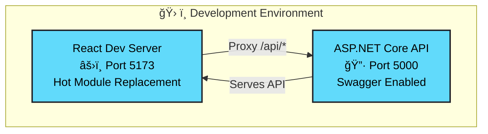
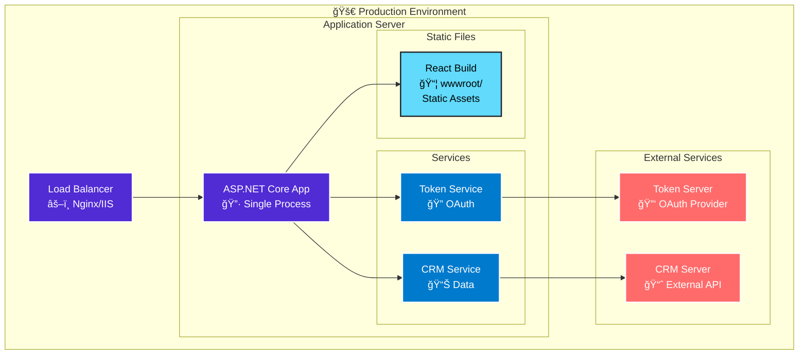

# Architecture Documentation

## Overview

The CRM Client Data Fetcher is a full-stack web application consisting of:
- **Backend**: ASP.NET Core 8.0 Web API (C#)
- **Frontend**: React 18 with Vite
- **Authentication**: OAuth 2.0 Client Credentials Flow

## System Architecture


## Frontend Architecture

### Routing Structure

The application uses React Router v6 for client-side routing:

```
/ (root)
├── /login (public route)
│   └── Login component
└── / (protected route)
    └── App component (wrapped in ProtectedRoute)
```

**Route Protection**:
- `/login`: Public route, accessible to all users
- `/`: Protected route, requires authentication
- `*` (catch-all): Redirects to `/login`

### Authentication Flow

```mermaid
sequenceDiagram
    participant User as 👤 User
    participant App as ⚛️ React App
    participant Auth as 🔐 AuthContext
    participant Storage as 💾 localStorage
    participant API as 🎮 Backend API
    
    Note over App,Storage: Application Initialization
    App->>Storage: Clear auth state on startup
    App->>Auth: Initialize AuthProvider
    Auth->>Storage: Check for existing auth
    Storage-->>Auth: Return auth state
    Auth-->>App: Set initial state
    
    Note over User,API: Login Flow
    User->>App: Navigate to /login
    User->>App: Enter credentials
    App->>Auth: login(username, password)
    Auth->>Auth: Validate input
    alt Valid credentials
        Auth->>Storage: Store auth state
        Auth-->>App: { success: true }
        App->>App: Navigate to /
    else Invalid credentials
        Auth-->>App: { success: false, error: "..." }
        App->>User: Display error message
    end
    
    Note over User,API: Protected Route Access
    User->>App: Navigate to /
    App->>ProtectedRoute: Check authentication
    ProtectedRoute->>Auth: useAuth()
    Auth->>Storage: Check auth state
    alt Authenticated
        Storage-->>Auth: isAuthenticated = true
        Auth-->>ProtectedRoute: Allow access
        ProtectedRoute-->>App: Render App component
    else Not authenticated
        Storage-->>Auth: isAuthenticated = false
        Auth-->>ProtectedRoute: Redirect needed
        ProtectedRoute->>App: Navigate to /login
    end
    
    Note over User,API: Logout Flow
    User->>App: Click logout button
    App->>Auth: logout()
    Auth->>Storage: Remove auth state
    Auth->>Auth: Clear state
    Auth-->>App: State cleared
    App->>App: Navigate to /login
```



### State Management

**Global State (AuthContext)**:
- Authentication status
- Current username
- Loading state

**Local Component State**:
- Form inputs (clientId, username, password)
- Loading states
- Error messages
- Client data

**Persistence**:
- Authentication state stored in `localStorage`
- Cleared on app initialization
- Persists across page refreshes

## Component Overview

### Component Relationships

```mermaid
graph LR
    subgraph Frontend["🌐 Frontend"]
        MainJSX[main.jsx<br/>🚀 Entry Point]
        AppJSX[App.jsx<br/>⚛️ Main Component]
        LoginJSX[Login.jsx<br/>🔐 Auth Page]
        ProtectedRoute[ProtectedRoute.jsx<br/>🛡️ Route Guard]
        AuthContext[AuthContext.jsx<br/>🔐 Auth State]
        ViteConfig[Vite Config<br/>⚡ Build Tool]
    end
    
    subgraph Backend["⚙️ Backend"]
        Program[Program.cs<br/>🚀 Startup]
        Controller[CrmController<br/>🎮 API Controller]
        
        subgraph Services["🔧 Services"]
            ICrmSvc[ICrmService<br/>📋 Interface]
            CrmSvc[CrmService<br/>📊 Implementation]
            ITokenSvc[ITokenService<br/>📋 Interface]
            TokenSvc[TokenService<br/>🔐 Implementation]
        end
        
        subgraph Config["⚙️ Configuration"]
            AppSettings[appsettings.json<br/>📝 Config]
            EnvVars[Environment Variables<br/>🔒 Secrets]
        end
    end
    
    MainJSX -->|Routes| AppJSX
    MainJSX -->|Routes| LoginJSX
    MainJSX -->|Wraps| AuthContext
    AppJSX -->|Uses| AuthContext
    AppJSX -->|Uses| ProtectedRoute
    LoginJSX -->|Uses| AuthContext
    ProtectedRoute -->|Uses| AuthContext
    AppJSX -->|HTTP Request| Controller
    ViteConfig -->|Proxy /api| Controller
    Program -->|DI Registration| Controller
    Program -->|DI Registration| Services
    Controller -->|Uses| ICrmSvc
    ICrmSvc -.->|Implemented by| CrmSvc
    CrmSvc -->|Uses| ITokenSvc
    ITokenSvc -.->|Implemented by| TokenSvc
    CrmSvc -->|Reads| AppSettings
    TokenSvc -->|Reads| AppSettings
    TokenSvc -->|Reads| EnvVars
    Program -->|Configures| Config
    
    classDef frontend fill:#61dafb,stroke:#20232a,stroke-width:2px,color:#000
    classDef backend fill:#512bd4,stroke:#fff,stroke-width:2px,color:#fff
    classDef service fill:#007acc,stroke:#fff,stroke-width:2px,color:#fff
    classDef interface fill:#4ec9b0,stroke:#fff,stroke-width:2px,color:#000
    classDef config fill:#ffa500,stroke:#fff,stroke-width:2px,color:#000
    
    class MainJSX,AppJSX,LoginJSX,ProtectedRoute,AuthContext,ViteConfig frontend
    class Program,Controller backend
    class CrmSvc,TokenSvc service
    class ICrmSvc,ITokenSvc interface
    class AppSettings,EnvVars config
```



### Backend Components

#### 1. **CrmController** (`Controllers/CrmController.cs`)
- **Purpose**: REST API endpoint for client data retrieval
- **Responsibilities**:
  - Accept HTTP GET requests with client ID parameter
  - Validate input parameters
  - Invoke CRM service to fetch data
  - Handle errors and return appropriate HTTP status codes
- **Route**: `/api/Crm/GetClientData`

#### 2. **CrmService** (`Services/CrmService.cs`)
- **Purpose**: Business logic for interacting with external CRM server
- **Responsibilities**:
  - Retrieve OAuth token from TokenService
  - Construct HTTP requests to CRM server
  - Apply OAuth token to request headers
  - Handle HTTP responses and errors
- **Dependencies**: `ITokenService`, `HttpClient`, `IConfiguration`

#### 3. **TokenService** (`Services/TokenService.cs`)
- **Purpose**: OAuth 2.0 token management
- **Responsibilities**:
  - Retrieve OAuth tokens from token server
  - Cache tokens in memory
  - Automatically refresh tokens before expiration
  - Thread-safe token retrieval (prevents concurrent requests)
- **Features**:
  - Token caching with 5-minute buffer before expiration
  - Semaphore-based locking for thread safety
  - Support for Basic Authentication and form-encoded requests
  - Configurable token header format

#### 4. **Program.cs**
- **Purpose**: Application startup and dependency injection configuration
- **Responsibilities**:
  - Configure services and middleware
  - Set up HTTP clients with base URLs and timeouts
  - Configure CORS for React frontend
  - Validate required configuration and environment variables

### Frontend Components

#### 1. **main.jsx**
- **Purpose**: Application entry point and routing configuration
- **Features**:
  - React Router setup with `BrowserRouter`
  - Route definitions for `/login` and `/` (protected)
  - Catch-all route redirects to login
  - `AuthProvider` wrapper for global authentication state
  - Clears authentication state on app initialization

#### 2. **App.jsx**
- **Purpose**: Main application component with client data search interface
- **Features**:
  - Search form with client ID input
  - HTTP request to backend API (`/api/Crm/GetClientData`)
  - Card-based data display with gradient accents
  - Loading states with spinner icon
  - Error handling with inline messages
  - Logout functionality
  - Results section with clear button
  - Animated gradient background

#### 3. **Login.jsx**
- **Purpose**: User authentication page
- **Features**:
  - Username and password input fields
  - Icon-enhanced form inputs (envelope, lock)
  - Form validation
  - Error message display
  - Integration with `AuthContext` for login
  - Redirects to main app on success

#### 4. **ProtectedRoute.jsx**
- **Purpose**: Route guard component for authenticated pages
- **Features**:
  - Checks authentication state via `useAuth` hook
  - Shows loading state during auth check
  - Redirects unauthenticated users to `/login`
  - Preserves attempted location for post-login redirect

#### 5. **AuthContext.jsx** (`contexts/AuthContext.jsx`)
- **Purpose**: Global authentication state management
- **Features**:
  - React Context API implementation
  - `AuthProvider` component for state provision
  - `useAuth` hook for consuming auth state
  - localStorage persistence for authentication
  - Login and logout functions
  - Loading state management

#### 6. **Vite Configuration** (`vite.config.js`)
- **Purpose**: Development server and build configuration
- **Features**:
  - Proxy configuration for API requests (`/api` → `http://localhost:5000`)
  - Development server on port 5173
  - Production build output to `wwwroot`
  - React plugin configuration
  - Path alias for `@frankcrum/earth` design system

#### 7. **Styling Files**
- **index.css**: Global styles with Tailwind CSS and Earth design system imports
- **App.css**: Main application page styles with card layouts and animations
- **Login.css**: Login page styles with form and card styling
- **PostCSS Configuration**: Tailwind CSS v4 processing

## Data Flow

### Client Data Retrieval Flow


## Authentication Flow

### OAuth 2.0 Client Credentials Flow


## Configuration Management

### Environment Variables
- **OAUTH_CLIENT_ID**: OAuth client identifier (required)
- **OAUTH_CLIENT_SECRET**: OAuth client secret (required)

### appsettings.json Structure
```json
{
  "ExternalApi": {
    "CrmServer": {
      "BaseUrl": "https://www.crmserver.com/",
      "TimeoutSeconds": 30
    },
    "Token": {
      "Endpoint": "https://www.tokenserver.com/oauth/token",
      "GrantType": "client_credentials",
      "Scope": "",
      "UseBasicAuth": false,
      "HeaderName": "Authorization",
      "HeaderFormat": "Bearer {0}"
    }
  }
}
```

## Security Considerations

1. **Environment Variables**: OAuth credentials stored in environment variables, never in code or configuration files
2. **Token Caching**: Tokens cached in memory only (not persisted to disk)
3. **HTTPS**: All external API calls use HTTPS
4. **CORS**: Configured to allow only specific origins (localhost:5173 in development)
5. **Input Validation**: Client IDs validated before processing
6. **Error Handling**: Errors logged without exposing sensitive information

## Thread Safety

The `TokenService` implements thread-safe token retrieval using:
- **SemaphoreSlim**: Ensures only one token request at a time
- **Double-Check Locking**: Prevents race conditions when checking cache
- **Immutable Cache**: Token cache updated atomically

## Error Handling Strategy

### Backend Error Handling
- **Validation Errors**: Return 400 Bad Request
- **CRM Server Errors**: Return 503 Service Unavailable
- **Unexpected Errors**: Return 500 Internal Server Error
- **All Errors**: Logged with appropriate log levels

### Frontend Error Handling
- Display user-friendly error messages
- Show loading states during API calls
- Handle network errors gracefully

## Testing Architecture

### Unit Tests
- **TokenServiceTests**: Mock HTTP client, test token caching and refresh logic
- **CrmServiceTests**: Mock token service and HTTP client, test request construction
- **CrmControllerTests**: Mock CRM service, test controller logic

### Integration Tests
- **LiveApiIntegrationTests**: Real HTTP requests to external servers
- Requires environment variables for OAuth credentials
- Tests end-to-end workflow

## Deployment Architecture

### Development Architecture



### Production Architecture



### Development vs Production

| Aspect | Development | Production |
|-------|------------|------------|
| **Frontend** | Separate Vite dev server (Port 5173) | Built and served from `wwwroot` |
| **Backend** | ASP.NET Core API (Port 5000) | Single ASP.NET Core application |
| **API Proxy** | Vite dev server proxies `/api/*` | Same origin, no proxy needed |
| **Hot Reload** | ✅ Enabled | ❌ Disabled |
| **Swagger** | ✅ Enabled | ❌ Disabled (optional) |
| **Static Files** | Served by Vite | Served by ASP.NET Core middleware |
| **Routing** | Client-side routing via Vite | Fallback to `index.html` for SPA |

## Scalability Considerations

1. **Stateless Design**: No server-side session state
2. **Token Caching**: Reduces token server load
3. **HTTP Client Reuse**: HttpClient instances reused via HttpClientFactory
4. **Async/Await**: Non-blocking I/O operations
5. **Configuration**: Timeout and retry policies configurable

## Future Enhancements

Potential improvements:
- Token refresh retry logic
- Circuit breaker pattern for external API calls
- Distributed token caching (Redis)
- Request/response logging middleware
- API rate limiting
- Health check endpoints
- OpenAPI/Swagger documentation generation
